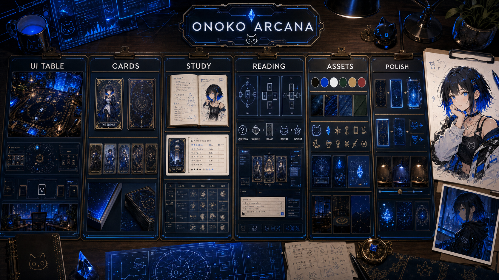

# ONOKO ARCANA 全体デザインカンバン

作成日: 2026-05-30  
版: v1 ONOKO identity draft

## デザイン方針

ONOKO ARCANA は、タロットカードを持っていない人が PC 上で占いを試しながら、カードの読み方も学べるソフトにする。

見た目の軸は「ONOKO のサイバー占い卓」。神秘的だが古典タロットに寄せすぎず、黒、白、鮮烈な青、猫アイコン、ホログラム、学習ノート、カード、意味解説が自然に同居する実用的な道具として設計する。

## ONOKO らしさ

参考元は `<local-onoko-reference-images>` のローカル画像群。直近の代表画像から、以下を ONOKO ARCANA の固有要素として扱う。

- 黒髪に鮮烈な青の差し色
- 青い瞳、白と青が強い衣装
- 黒、白、エレクトリックブルーの高コントラスト
- 夜の部屋、ホログラム、透明パネル、サイバーUI
- 小さな猫アイコン、星、結晶、光る線
- かわいさだけでなく、静かに観測しているガイド感

## カンバン

### UI TABLE

- [ ] ダークウォルナットの机に、黒い占い卓と青いホログラムを重ねる
- [ ] 中央にカード配置スロットと円形の観測盤を置く
- [ ] 右側にカード意味、左側に履歴またはメモを置く
- [ ] 1枚引き、3枚引き、自由配置に対応できる余白を確保する
- [ ] アプリUIではなく「ONOKO の机上にある占い道具」に見える画面密度にする

### CARDS

- [x] カード比率、角丸、枠線、番号位置を決める
- [ ] 裏面は上下対称で、猫、結晶、観測線を組み合わせる
- [ ] 表面は古典タロット絵ではなく、ONOKO風の人物、記号、夜景、青い光で構成する
- [x] 正位置と逆位置のキーワードを学習用に読める形で入れる
- [x] まずは大アルカナ 22 枚を初期スコープにする

### STUDY

- [ ] カードごとの基本意味、象徴、キーワードを整理する
- [ ] ユーザーが先に自分の解釈を書ける欄を作る
- [ ] その後に補助解釈を表示する学習フローにする
- [ ] 読み返し用に過去の解釈メモを保存する
- [ ] カード意味を暗記ではなく比較で覚えられる表示にする

### READING

- [ ] 1枚引きの最短占いフローを作る
- [ ] 過去、現在、未来の3枚引きを作る
- [ ] シャッフル、ドロー、リバース判定の挙動を決める
- [ ] 質問、引いたカード、解釈、結果メモを1件の履歴にする
- [ ] 結果画面から学習画面へ戻れる導線を作る

### ASSETS

- [ ] カラーパレットを墨黒、エレクトリックブルー、白、アイボリー、鈍い金で固定する
- [ ] 木目、黒アクリル、透明ホログラム、紙、真鍮の質感を基準素材にする
- [ ] 猫、結晶、月、星、鍵、杯、剣、観測線などの小アイコン群を作る
- [ ] カード表面、カード裏面、テーブル背景の画像生成プロンプトを残す
- [ ] アプリ内で使う画像と設計用ムード画像を分けて管理する

### POLISH

- [ ] カードを引く時の短いアニメーションを設計する
- [ ] 机上の光、影、ホバー状態を控えめに入れる
- [ ] 小さい画面でもカード名と意味が読めるようにする
- [ ] 色に頼りすぎず、線、形、配置でも状態が分かるようにする
- [ ] 初回起動時に説明文を増やしすぎず、操作で覚えられる導線にする

## 今回の固定事項

- UI は「ONOKO のサイバー占い卓」
- カードは「ONOKO風の青い光、猫、結晶、観測記号」
- 最初の範囲は「大アルカナ 22 枚」
- 学習は「ユーザー解釈を先に書く」形を優先
- ONOKO ORACLE の一般判断支援とは分け、ARCANA はタロット学習と占いに特化する

## 参考画像

- v1 ONOKO寄せカンバン: `assets/design/onoko-arcana-design-kanban-v1-onoko.png`
- v0 古書テーブル寄せカンバン: `assets/design/onoko-arcana-design-kanban-v0.png`
- ONOKO参考コンタクトシート: `assets/reference/onoko-reference-contact-sheet-recent.png`
- 生成素材シード: `assets/source/onoko-arcana-asset-seed-sheet-v0.png`
- 切り出し素材プレビュー: `assets/generated/asset-crops-preview-v0.png`

## 関連ロードマップ

- 現行の研究水準ロードマップ v2: `docs/roadmap/ONOKO_ARCANA_RESEARCH_GRADE_ROADMAP_V2_2026-05-31.md`
- Unreal Engine版へ進むための研究ロードマップ: `docs/roadmap/ONOKO_ARCANA_UNREAL_RESEARCH_ROADMAP_2026-05-31.md`
- ブラウザ確認用HTML: `reports/onoko-arcana-unreal-roadmap-2026-05-31.html`
