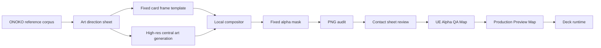
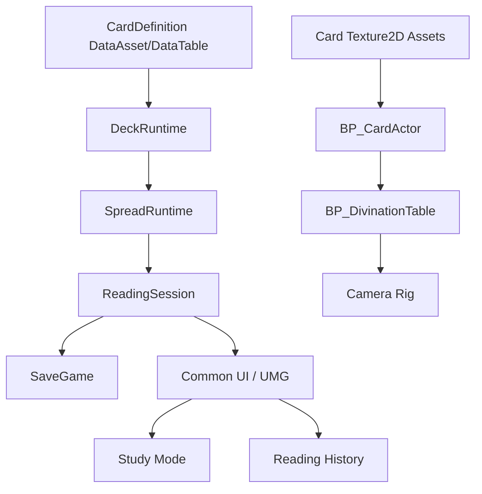

# ONOKO ARCANA Research-Grade Roadmap v2

作成日: 2026-05-31  
対象: `<repo>`
版: v2.0 research-grade roadmap  
位置づけ: 透過漏れ、裏面比率、ONOKOキャラクター画質劣化を踏まえた再計画

## Abstract

本稿は、ONOKO ARCANAを「タロットカードを所持していないユーザーがPC上で占いを実行し、操作しながらカード解釈を学習できる3Dデスクトップソフト」へ完成させるための研究水準ロードマップである。

v1ロードマップでは、Unreal Engine 5.7系を採用し、既存の大アルカナ22枚、カード裏面、ONOKOサイバー占い卓カンバン、JSONカード定義、Phase 0 Unrealプロジェクトをつなぐ大枠を定義した。しかしPhase 0の実機確認により、カード裏面の見かけ幅、背景透過漏れ、外周ハロー、UE上の影との誤判定、さらに生成後処理によるONOKO人物部の破壊が確認された。

本v2では、単なる「全カードを再生成する工程表」ではなく、生成、切り抜き、合成、監査、Unreal取り込み、目視QA、学習UI、配布ビルドまでを、証拠ベースの段階的研究計画として再定義する。結論として、本番素材はフルカード一枚絵を大量生成する方式から、固定カードテンプレート、中央イラスト、UI空白パネル、固定alphaマスクを分離して制御する方式へ移行する。大アルカナ22枚を最初の正式デッキとし、小アルカナ56枚はパイプラインが合格した後のExpansion Gateで扱う。

### 2026-06-01 Amendment: V5 Clean Start

Phase 0BのV4 layered prototypeを実際にUEで拡大確認した結果、旧カードから中央絵を切り出す方式では、旧フレーム要素の混入、イラストの横長化、中央絵が新フレーム下へ潜る問題が確認された。

このため、V4の旧素材再合成ルートは停止し、Phase 0BをV5 clean-start検証へ改訂する。V5は「無制御な一括フルカード生成」への回帰ではなく、次の制約を満たす1枚単位の新規生成パイプラインである。

- `1024x1536`、`2:3` の完成カードとして最初から生成する。
- カード外のみフラットなクロマキー背景にし、ローカルでalpha化する。
- 文字は焼き込まず、上部/下部パネルは空欄にする。
- 中央イラスト、フレーム、パネル、外形が1枚の完成カードとして破綻していないことを目視QAする。
- 22枚量産前に、1枚だけUnreal import、Masked Material、2:3 Plane、QA Mapで通す。
- V5の可視カード外形は従来bboxより細めでもよい。タロットカード感を優先し、ユーザー確認済みの縦長シルエットを採用する。

V5の基準資料は `docs/design/card-production-v5-clean-start.md` とする。

## Keywords

ONOKO ARCANA, Unreal Engine 5.7, tarot learning, image-first production, transparent PNG, alpha QA, card asset pipeline, 3D divination table, Common UI, Blueprint-first, research roadmap

## 0. Skill Stack And Method

今回の計画では、ユーザーが明示した3つのSkillを次の役割で使う。

| Skill | Role | Application |
|---|---|---|
| `define-requirements` | 要件定義と受け入れ条件 | `.agent/requirements/20260531-2245-research-grade-roadmap/` に目的、範囲、要件、実装ブリーフを残す |
| `orchestrate-skills` | Skill選定と作業順序 | 明示Skillを中心に、Browser/Playwright/Build Webは今回は実装なしのため保留と判断 |
| `image-first-frontend` | 画像参照起点の制作方法 | Unreal向けでも、参照画像、デザイン在庫、レンダー比較、目視差分修正の流れを採用 |

補足:

- 今回はロードマップ作成が目的であり、新規画像生成、Unreal起動、ブラウザ実装は行わない。
- ただし、既存画像、監査JSON、Unreal Phase 0結果、公式ドキュメントを根拠としてロードマップを作る。
- 実装フェーズでは、Browser/PlaywrightはHTMLレポートやWebプロトタイプ確認に使い、Unreal確認はEditorスクリーンショットと専用QA Mapで扱う。

## 1. Problem Statement

ONOKO ARCANAの当面の問題は、素材が「存在する」ことでは解決しない。問題は、素材がUnreal Engine上で本番カードとして一貫して表示できる品質基準に達しているか、そしてカード画像が学習ソフトとして読めるかである。

現在観測された主要問題は次の通り。

1. カード外周に背景、ハロー、影、疑似透明が焼き込まれ、UE上で矩形漏れとして見える。
2. 生成画像ごとにカードbboxがずれ、表面と裏面の見かけ幅が一致しない。
3. 透明化後処理がマゼンタ類似色を全画素対象で削除し、ONOKOの肌、手、顔、白ハイライトを破壊した。
4. フルカード一枚絵生成では、ONOKO人物がカード内の小さな領域に圧縮され、顔と手のディテールが本番カードとして弱い。
5. UEのPlane影、Masked Material、Texture Alpha、実画像alpha漏れが混ざり、目視上の原因分離が難しい。
6. 22枚以降の量産へ進む前に、生成からUE表示までのProof Gateが不足している。

本ロードマップの中心仮説は次である。

> ONOKO ARCANAの本番カード制作は、AI生成画像そのものを直接最終素材にするのではなく、固定テンプレート、中央高解像度アート、固定alpha、UE専用監査、目視QAを通した「管理された素材パイプライン」として扱う必要がある。

## 2. Evidence Corpus

### 2.1 Local Project Evidence

| Evidence | Path | Finding |
|---|---|---|
| Phase 0 baseline | `docs/unreal/PHASE0_BASELINE_2026-05-31.md` | UE 5.7.4、プロジェクト、Texture import、Masked Material、確認Map作成済み |
| Transparency replan | `docs/design/ue-card-transparency-regeneration-plan-2026-05-31.md` | 透過漏れ、alpha bbox、人物破壊、固定mask方式を整理済み |
| Design kanban | `docs/design/overall-design-kanban.md` | ONOKOサイバー占い卓、2:3カード、大アルカナ22枚、学習導線を固定済み |
| Card production v1 | `docs/design/card-front-production-v1.md` | `1024x1536`、`2:3`、テキスト非焼き込み、v2採用カードを記録済み |
| Major Arcana JSON | `data/major-arcana-cards.json` | 大アルカナ22枚のカード定義が存在。小アルカナ定義は未作成 |
| UE project | `Unreal/ONOKO_ARCANA/ONOKO_ARCANA.uproject` | EngineAssociation `5.7`、CommonUI、PythonScriptPlugin、EditorScriptingUtilities有効 |
| Alpha audit | `assets/generated/reports/ue-card-alpha-audit-v3-connected-2026-05-31.json` | v3 00/01/02/backはサイズ、bbox、binary alpha、visible magentaが合格 |
| Processor | `scripts/prepare_ue_card_png.py` | 連結背景検出、固定矩形、固定丸角alpha、可視key spill黒置換を実装済み |
| Auditor | `scripts/audit_ue_card_alpha.py` | `1024x1536`、bbox `(54,32,970,1514)`、0/255 alpha、key pixelを監査 |

### 2.2 Visual Reference Corpus

| Reference | Path | Role |
|---|---|---|
| ONOKO design kanban v1 | `assets/design/onoko-arcana-design-kanban-v1-onoko.png` | 世界観、卓、カード、学習UIの第一参照 |
| ONOKO reference contact sheet | `assets/reference/onoko-reference-contact-sheet-recent.png` | 黒髪、青目、白青衣装、夜、サイバーUIの人格参照 |
| Asset seed sheet | `assets/source/onoko-arcana-asset-seed-sheet-v0.png` | 卓、フレーム、結晶、観測線、質感素材の種 |
| Contact sheet v2 | `assets/generated/reports/major-arcana-contact-sheet-v2.png` | 既存大アルカナ全体の比較対象 |
| Character damage proof | `assets/generated/card-fronts/ue-v3-reports/source-vs-alpha-character-damage-check.png` | 透明化処理が人物品質を壊した証拠 |
| Fixed crop proof | `assets/generated/card-fronts/ue-v3-reports/ue-v3-character-crop-quality-check-fixed.png` | 処理修正後の人物破壊回避の証拠 |

### 2.3 Official References Checked

- [OpenAI Image generation guide](https://developers.openai.com/api/docs/guides/image-generation): GPT Image系ではサイズ、品質、形式、圧縮、透明背景などの出力制御が可能。ただしCodex内蔵の `image_gen` ではAPIパラメータを直接指定できないため、native transparentを使う場合は明示的なAPI経路を別途設計する。
- [Unreal Engine 5.7 Release Notes](https://dev.epicgames.com/documentation/unreal-engine/unreal-engine-5-7-release-notes?lang=en-US): UE 5.7系の公式リリース情報。ローカルでは `5.7.4-51494982+++UE5+Release-5.7-Windows` を確認済み。
- [Unreal Engine Material Blend Modes](https://dev.epicgames.com/documentation/unreal-engine/material-blend-modes-in-unreal-engine?lang=en-US): MaskedはOpacity Mask Clip Valueで描画/破棄を分ける。カード外形は二値alphaとMasked Materialを第一候補にする。

## 3. Design Thesis

ONOKO ARCANAは、古典タロットの装飾をそのまま再現するソフトではない。中心体験は、ONOKOの観測的な世界観を通して、ユーザーがカードを引き、意味を考え、記録し、比較し、少しずつ読みを身につけることである。

### 3.1 Visual Identity

| Layer | Direction | Must Hold |
|---|---|---|
| Table | 黒アクリル、ダークウッド、青い観測リング、控えめな金属 | 白い検証板のまま進めない |
| Card | `1024x1536`、2:3、鈍い金枠、黒地、電気青、空白パネル | 過度な縦長化を禁止 |
| ONOKO | 黒髪、青い瞳、白青黒の衣装、静かな観測者 | 顔と手が粗い素材を本採用しない |
| UI | 操作道具として静かで読みやすい | 説明文を増やしすぎず、学習操作で理解させる |
| Motion | 短いシャッフル、ドロー、反転、ホバー発光 | 読みやすさを邪魔しない |

### 3.2 Product Boundary

ONOKO ARCANAはタロット学習と占い操作に特化する。ONOKO ORACLEのような一般判断支援、創作相談、汎用神託UIとは分ける。共通するのはONOKOの世界観であり、プロダクトの主目的は混ぜない。

## 4. Research Questions

1. AI生成由来のカード画像をUnreal向け本番Textureにするには、どの段階でalphaを確定すべきか。
2. ONOKO人物の顔と手を本番品質に保つため、カード全体生成と分離生成のどちらが再生成コストを下げるか。
3. `1024x1536` PNGを22枚、将来的に78枚扱う場合、Texture import、ロード、メモリ、拡大表示の品質は実用的か。
4. Masked Material、丸角カードMesh、Plane shadowの組み合わせで、矩形影や外周漏れをどこまで抑えられるか。
5. ユーザーが先に自分の解釈を書く学習フローは、1枚引き、3枚引き、カード学習ビューで同じデータ構造にできるか。
6. ONOKOらしさは、キャラクター立ち絵だけに依存せず、卓、光、カード、猫アイコン、記録UIで成立するか。
7. 大アルカナ22枚の品質基準が固まった後、小アルカナ56枚をどう量産すれば、画風と合格基準が崩れないか。

## 5. Production Hypothesis

### 5.1 Rejected Model: One-Pass Full Card Generation

```text
----------------------+
| AI generates card   |
| full frame + figure |
| + border + panels   |
+----------+-----------+
           |
           v
    alpha removal
           |
           v
        UE import
```

この方式は初速が速いが、次の理由で本番量産には不向きである。

- ONOKO人物が小さくなり、顔と手の品質確認が難しい。
- カード外形、角丸、枠幅、余白、裏面幅が生成ごとに揺れる。
- 透明背景を指定しても、外周ハローや影が焼き込まれることがある。
- 後処理が強すぎると人物内部まで壊れる。
- 1枚NGになった時、枠、背景、人物、パネルを全部再生成する必要がある。

### 5.2 Adopted Model: Layered Image-First Pipeline



採用方式では、カード本体の外形、空白パネル、枠、中央イラスト、alphaを分離する。ONOKO人物/場面は中央アート枠用に大きく生成し、顔と手を目視してから合成する。最後に固定alpha maskを適用し、UE用PNGとして監査する。

## 6. Asset Pipeline Specification

### 6.1 Canonical Card Geometry

| Property | Value |
|---|---:|
| Canvas | `1024x1536` |
| Ratio | `2:3` |
| Final alpha bbox | `(54, 32, 970, 1514)` |
| Visible card size | `916x1482` |
| Corner radius | `52` |
| Alpha values | `0` or `255` only |
| Text baked into image | None |

### 6.2 Layer Model

| Layer | Generated? | Editable? | Notes |
|---|---|---|---|
| Outer card silhouette | No | Scripted | Fixed alpha mask only |
| Card frame | Initially generated, then fixed | Yes | Gold/black/blue border, same for all cards |
| Top panel | Template | Yes | Card number/name overlay area |
| Bottom panel | Template | Yes | Keywords/study text overlay area |
| Central art | Generated per card | Yes | ONOKO figure and tarot symbol |
| Back design | Generated once, then fixed | Yes | Same outer bbox as front |
| App text | Runtime UI | Yes | UE/UMG overlays, no image text |

### 6.3 File Taxonomy

Recommended new directories:

```text
assets/generated/card-production-v4/
  templates/
    card-frame-front-v4.png
    card-frame-back-v4.png
    card-alpha-mask-1024x1536-v1.png
  central-art-source/
    major-00-fool-central-v4-source.png
  central-art-approved/
    major-00-fool-central-v4-approved.png
  composed/
    major-00-fool-onoko-v4-composed.png
  ue-alpha/
    major-00-fool-onoko-v4-alpha.png
  reports/
    v4-contact-sheet-major-00-02.png
    v4-character-crop-audit-major-00-02.png
    v4-alpha-audit.json
```

Unreal staging:

```text
Unreal/ONOKO_ARCANA/ImportStaging/MajorArcana_V4/
  card-back-onoko-v4-alpha.png
  major-00-fool-onoko-v4-alpha.png
```

### 6.4 Required Automated Checks

| Check | Tool | Pass Condition |
|---|---|---|
| Canvas size | `scripts/audit_ue_card_alpha.py` or successor | `1024x1536` |
| Alpha bbox | same | `(54, 32, 970, 1514)` |
| Binary alpha | same | only `{0,255}` |
| Visible key spill | same | `0` |
| Character crop | new QA script | face/hands crop saved for visual review |
| Contact sheet | new report script | all candidates visible at same scale |
| UE import | Unreal Python | Texture dimensions match source |
| UE alpha view | QA Map screenshot | no rectangular leakage |

### 6.5 Human Review Gates

AI画像生成の品質は数値だけで採用できない。次の目視ゲートを必須にする。

1. ONOKOの顔が粗くない。
2. 手指が明らかに崩れていない。
3. カード固有象徴が読める。
4. 空白パネルに疑似文字が入っていない。
5. 既存カードと枠幅、発光、金色、青の強さが揃っている。
6. UE上で表面と裏面の見かけ幅が一致する。
7. 学習UIの重ね文字を邪魔する高コントラスト模様がパネル内にない。

## 7. Unreal Engine Architecture

### 7.1 Engine Baseline

Local verified version:

```text
<UE_5.7>
5.7.4-51494982+++UE5+Release-5.7-Windows
```

Project:

```text
Unreal/ONOKO_ARCANA/ONOKO_ARCANA.uproject
```

Enabled plugins:

- CommonUI
- PythonScriptPlugin
- EditorScriptingUtilities
- ModelingToolsEditorMode

### 7.2 Runtime Modules



### 7.3 Key Blueprint Classes

| Blueprint | Responsibility | Phase |
|---|---|---|
| `BP_DivinationTable` | 卓、カードスロット、観測リング、ライト | Phase 1 |
| `BP_CardActor` | 表裏Texture、flip、hover、selection | Phase 1 |
| `BP_DeckRuntime` | 山札生成、シャッフル、重複排除、draw | Phase 1 |
| `BP_SpreadSlot` | 1枚引き/3枚引き/自由配置のslot | Phase 1-3 |
| `BP_ReadingSession` | 質問、カード、正逆、ユーザーメモ、補助表示 | Phase 2 |
| `WBP_TableHUD` | Draw、Reset、Save、Study、History | Phase 1-2 |
| `WBP_CardDetail` | カード名、キーワード、学習焦点、ユーザーメモ | Phase 1-2 |
| `WBP_StudyGallery` | 大アルカナ一覧、カード詳細 | Phase 3 |

### 7.4 Material Policy

| Use Case | Material Mode | Reason |
|---|---|---|
| Card hard silhouette | Masked | Fixed binary alpha and stable edges |
| Glow overlay | Additive or translucent overlay mesh | Card body alphaと分ける |
| Hologram ring | Additive/AlphaComposite | 卓上エフェクト専用 |
| Debug alpha | Unlit Masked | ライトと影を切り離して確認 |

カード外形確認では、画像alpha問題とPlane影問題を混同しない。Alpha QA MapではカードのCast Shadowを無効化し、Production Previewで初めて影を評価する。

## 8. Roadmap Phases

### Phase 0A: Evidence Freeze And Decision Lock

Goal:
既存素材と失敗原因を固定し、今後の量産基準をブレさせない。

Inputs:
- `docs/unreal/PHASE0_BASELINE_2026-05-31.md`
- `docs/design/ue-card-transparency-regeneration-plan-2026-05-31.md`
- `assets/generated/card-fronts/ue-v3-reports/*`
- `assets/generated/reports/ue-card-alpha-audit-v3-connected-2026-05-31.json`

Outputs:
- This roadmap v2
- `.agent/requirements/20260531-2245-research-grade-roadmap/`
- v4 asset pipeline task list

Acceptance:
- One-pass full-card generation is no longer treated as the final production method.
- `1024x1536`、`2:3`、bbox `(54,32,970,1514)` が正式基準として明記されている。
- 大アルカナ22枚を初期本番スコープ、小アルカナ56枚をExpansion Gate後とする。

### Phase 0B: V4 Layered Card Pipeline Prototype

Goal:
カード3枚と裏面1枚で、分離生成、合成、固定alpha、監査、目視確認までの最小パイプラインを作る。

Scope:
- 00 Fool
- 01 Magician
- 02 High Priestess
- Card back

Outputs:
- Fixed front frame template
- Fixed back frame template
- Central art generation prompts
- Compositor script
- Character crop report
- Contact sheet report
- V4 alpha audit JSON

Acceptance:
- 4枚すべて `1024x1536`。
- alpha bboxが全て `(54,32,970,1514)`。
- visible key spillが0。
- 顔/手cropが目視でv3より明確に改善している。
- 表面と裏面の見かけ幅がcontact sheet上で一致する。

Stop Condition:
3枚中2枚以上で人物品質が低い場合、カード一枚合成ではなく中央アート生成条件を先に改善する。UE importへ進まない。

### Phase 0C: Unreal Alpha QA Map

Goal:
UE内で透過漏れと影問題を分離して判定できる専用Mapを作る。

Outputs:
- `L_QA_CardAlpha_Check`
- Unlit Masked material
- Checkerboard or high-contrast background plane
- Cast Shadow disabled card actors
- Fixed camera
- Screenshot capture procedure

Acceptance:
- V4 00/01/02/backを正面比較できる。
- カード外に矩形、白/灰ハロー、マゼンタ残りが見えない。
- 表裏の幅差が見えない。
- このMap上で問題が出た場合、Production Previewには進まない。

### Phase 0D: Production Preview Table Upgrade

Goal:
白いプレースホルダー卓を、ONOKOサイバー占い卓へ置き換える。

Outputs:
- Dark table material
- Black acrylic mat
- Blue observation rings
- Muted gold trim
- Key light/fill light setup
- Camera framing
- Card shadow policy

Acceptance:
- 最初の画面が実際の占い卓として成立する。
- 画像alphaが合格済みであることを前提に、影と接地感だけを評価できる。
- カードの上下パネルが読める明るさを維持する。

### Phase 1: One-Card Vertical Slice

Goal:
1枚引きが、3D卓、カード操作、カード詳細UI、正逆、学習メモまで縦につながる。

Outputs:
- `BP_DivinationTable`
- `BP_CardActor`
- `BP_DeckRuntime`
- `WBP_TableHUD`
- `WBP_CardDetail`
- Data import path for 22 major cards

Acceptance:
- Drawを押すと山札から1枚が重複なく選ばれる。
- カードがスロットへ移動し、表面へ反転する。
- upright/reversedがランダムに決まり、キーワード表示が切り替わる。
- ユーザーは補助解釈を見る前に自分の解釈を書ける。
- Resetで次の占いを開始できる。

### Phase 2: Learning Loop And SaveGame

Goal:
学習ソフトとしての中心価値である「自分の読み、補助解釈、履歴」を保存できるようにする。

Outputs:
- Question input
- User interpretation note
- Reveal guide action
- SaveGame schema
- History list
- Session restore

Acceptance:
- 質問、カードID、正逆、ユーザーメモ、補助表示状態、日時が保存される。
- アプリ再起動後も履歴が読める。
- 空入力、保存失敗、履歴なし状態が破綻しない。
- 補助解釈はユーザーメモより先に強制表示されない。

### Phase 3: Three-Card Reading And Study Mode

Goal:
大アルカナ22枚を学習対象として扱い、3枚引きとカード別学習を成立させる。

Outputs:
- Past/Present/Future spread
- Three spread slots
- Card gallery
- Card detail study view
- Upright/reversed comparison UI

Acceptance:
- 3枚引きで同一セッション内の重複が出ない。
- 22枚全カードがギャラリーで表示される。
- ギャラリーから各カードの意味と既存履歴へ移動できる。
- 読みの流れが1枚引きと同じデータ構造で保存される。

### Phase 4: Major Arcana Production Pass

Goal:
大アルカナ22枚をV4 pipelineで本番候補へ更新し、UEへ一括取り込みできる状態にする。

Outputs:
- 22 central art images
- 22 composed card images
- 22 UE alpha PNGs
- Card back V4
- Contact sheet
- Character crop sheet
- Alpha audit JSON
- UE import manifest

Acceptance:
- 22枚+裏面のalpha auditが全OK。
- 目視分類が `Adopted`, `Needs Regeneration`, `Blocked` のいずれかで記録される。
- `Needs Regeneration` が0になるまでProduction buildには入れない。
- UEのQA MapとProduction Preview Mapの両方で合格する。

### Phase 5: ONOKO Polish Layer

Goal:
見た目をONOKO ARCANAらしくしながら、長時間使える操作性を保つ。

Outputs:
- Hover glow
- Draw/flip animation
- Table ambient effects
- Optional ONOKO guide panel
- Sound placeholders
- Visual accessibility pass

Acceptance:
- 発光やアニメーションがカード名、キーワード、メモ入力を邪魔しない。
- 操作状態は色だけでなく、位置、形、アイコン、動きでも分かる。
- 初回説明に頼りすぎず、操作から学べる。

### Phase 6: Internal Windows Build

Goal:
ローカルPCで起動できるWindows開発ビルドを作り、実使用の問題を見つける。

Outputs:
- Windows Development build
- Build notes
- Manual smoke checklist
- Known issues report

Acceptance:
- パッケージ済みアプリが起動する。
- 1枚引き、3枚引き、履歴保存が動く。
- Texture欠落、文字化け、SaveGame失敗がない。
- 10分程度の手動操作でクラッシュしない。

### Phase 7: Expansion Gate For Minor Arcana

Goal:
小アルカナ56枚へ進むか判断する。

Prerequisites:
- 大アルカナ22枚がV4本番品質で合格。
- DeckRuntimeとStudy UIが22枚で破綻しない。
- 生成/合成/監査/UE importの手順が再現可能。

Decision Options:

| Option | Meaning | When To Choose |
|---|---|---|
| A: Expand to 78 cards | 小アルカナ56枚を追加 | 大アルカナの品質と操作体験が安定した場合 |
| B: Add spreads first | ケルト十字などを追加 | カード数より占い体験を深めたい場合 |
| C: Improve ONOKO guide first | ガイド/解説/履歴分析を強化 | 学習価値を先に上げたい場合 |

Recommendation:
大アルカナだけでも学習ソフトとして成立させた後、78枚化する。カード数を先に増やすと、画質QAとUI修正の負債が大きくなる。

## 9. Definition Of Done

ONOKO ARCANAの「完成」は、単にカード画像が揃った状態ではない。次の条件を満たす状態をCompletion Candidateとする。

### 9.1 MVP Done

- UE 5.7.4プロジェクトがローカルで開ける。
- 大アルカナ22枚と裏面1枚がV4 asset pipelineで合格している。
- 1枚引きと3枚引きができる。
- ユーザーが自分の解釈を入力できる。
- 補助解釈を後から表示できる。
- 履歴を保存、再表示できる。
- Windows開発ビルドで上記が動く。

### 9.2 Visual Done

- カードは全て2:3、同一外形、同一見かけ幅。
- UE Alpha QA Mapで矩形漏れがない。
- Production Preview Mapで影と接地感が自然。
- ONOKOの顔と手が本番品質として許容できる。
- 卓が白い検証面ではなく、ONOKOサイバー占い卓として成立している。

### 9.3 Learning Done

- カード名、日本語名、正位置、逆位置、学習焦点が読める。
- ユーザーの解釈が補助解釈より先に扱われる。
- 履歴から自分の読みの変化を見返せる。
- カード学習ビューと占い結果ビューが相互に移動できる。

### 9.4 Engineering Done

- 生成素材の採用理由とNG理由がレポートに残る。
- 画像監査が再実行できる。
- UE import manifestが再生成できる。
- 主要Blueprintの責務が分離されている。
- パッケージビルド手順が文書化されている。

## 10. Risk Register

| Risk | Impact | Likelihood | Mitigation | Owner Phase |
|---|---:|---:|---|---|
| AI生成でONOKO人物品質が安定しない | High | High | 中央アート分離、crop QA、少数カードで検証 | 0B |
| 透過漏れがUE上で再発 | High | Medium | 固定alpha、QA Map、shadow分離 | 0B-0C |
| 裏面だけ太く見える | Medium | Medium | 同一bbox、同一template、contact sheet幅比較 | 0B |
| 小アルカナ量産で品質負債が増える | High | High | Expansion Gateまで保留 | 7 |
| Blueprintが肥大化 | Medium | Medium | DeckRuntime/Session/UIの責務分離 | 1-3 |
| Textureメモリ増加 | Medium | Medium | 22枚で計測後、必要ならLOD/streaming/圧縮検討 | 4 |
| 学習UIが読みにくい | High | Medium | UMG text overlay、パネル領域固定、Preview QA | 1-3 |
| 見た目が装飾過多になる | Medium | Medium | ONOKO卓は操作道具として設計、発光は控えめ | 0D-5 |

## 11. Immediate Work Orders

次に実施すべき順序は以下。

1. `Phase 0B` としてV4の分離合成パイプラインを作る。
2. 00/01/02/backだけで、中央アート生成、テンプレ合成、固定alpha、監査、contact sheet、character crop reportを作る。
3. 4枚が目視合格したら、`L_QA_CardAlpha_Check` を作りUEで透過だけ確認する。
4. Alpha QAが合格したら、白い検証面をONOKO占い卓へ置き換える。
5. その後に1枚引きVertical Sliceへ進む。

やってはいけない順序:

- 22枚を先に一括再生成する。
- 小アルカナ56枚へ進む。
- Alpha QAなしでProduction Previewだけ見る。
- 人物crop確認なしで採用する。
- 文字をカード画像へ焼き込む。

## 12. Appendix: Command And Artifact Checklist

### Existing Verified Commands

```powershell
python scripts/audit_ue_card_alpha.py assets/generated/card-fronts/ue-v3-alpha/*.png assets/generated/card-backs/card-back-onoko-production-v3-alpha.png --out assets/generated/reports/ue-card-alpha-audit-v3-connected-2026-05-31.json
```

### New Scripts To Add

| Script | Purpose |
|---|---|
| `scripts/compose_onoko_card_layers.py` | frame + central art + panels + alpha maskを合成 |
| `scripts/build_card_contact_sheet.py` | 全カード比較シート作成 |
| `scripts/export_character_crop_report.py` | 顔/手/中央アートの目視QAシート作成 |
| `Unreal/ONOKO_ARCANA/Scripts/import_major_arcana_v4_textures.py` | V4 assetsをUEへ一括import |
| `Unreal/ONOKO_ARCANA/Scripts/create_card_alpha_qa_map.py` | Alpha QA Map生成 |

### Documentation To Keep Current

| Document | Update Trigger |
|---|---|
| `docs/design/ue-card-transparency-regeneration-plan-2026-05-31.md` | alpha pipelineが変わった時 |
| `docs/design/card-front-production-v1.md` | card production statusが変わった時 |
| `docs/unreal/PHASE0_BASELINE_2026-05-31.md` | UE Phase 0結果を更新した時 |
| This roadmap | major phase decisionが変わった時 |
