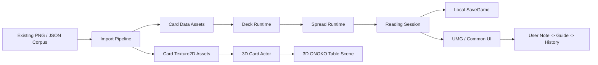

# ONOKO ARCANA Unreal Engine Research Roadmap

作成日: 2026-05-31  
対象: `C:\ONOKO_PROJECT\ONOKO_ARCANA`  
版: v1.0 research roadmap  
関連HTML: `reports/onoko-arcana-unreal-roadmap-2026-05-31.html`

> 現行の再計画版は `docs/roadmap/ONOKO_ARCANA_RESEARCH_GRADE_ROADMAP_V2_2026-05-31.md`。このv1はPhase 0開始時点の履歴として保持する。

## Abstract

本稿は、ONOKO ARCANAを「タロットカードを持たないユーザーがPC上で占いを操作しながら学習できる、ONOKO世界観の立体的デスクトップソフト」へ発展させるための研究ロードマップである。既存成果物として、全体デザインカンバン、ONOKO参考コンタクトシート、生成素材シード、カード裏面、カード表面テンプレート、大アルカナ22枚、v2差し替え4枚、カード定義JSON、HTMLギャラリー、確認レポート、HTML試作が存在する。本稿では、それらを統合的な制作コーパスとして整理し、Unreal Engine 5.7系を第一候補とする技術方針、縦断スライス、フェーズ計画、品質ゲート、リスク、検証実験を定義する。

## Keywords

ONOKO ARCANA, tarot learning, Unreal Engine, cyber divination table, 3D desktop app, major arcana, asset pipeline, UMG, Blueprint, local save

## 1. Introduction

ONOKO ARCANAの中心価値は、単にカード画像を表示することではない。ユーザーがPC上の占い卓でカードを引き、意味を読み、自分の解釈を書き、補助解釈と比較し、履歴として残すことで、タロットを身体化された操作として学べる点にある。

初期の議論では、タロットカードを所持していなくてもPCで占えるソフト、かつタロットを勉強しながら操作できる体験が求められた。その後、ONOKOらしさを強く出す方向へ進み、カンバンボード、カード裏面、カード表面、大アルカナ一覧が作成された。カードの上下比率については、過度に細長い一般タロット比率ではなく、元の00番カードに合わせた `1024x1536px`、`2:3` が正式基準として固定された。

本ロードマップの目的は、現在の素材群を将来のUnreal Engine版実装へ接続することである。特に、追加素材量産より先に、3D占い卓、カードTexture、UIパネル、保存、学習導線を小さく接続する縦断スライスを作ることを推奨する。

## 2. Current Artifact Corpus

### 2.1 Design Boards

| Artifact | Path | Role | Status |
|---|---|---|---|
| ONOKO ARCANA design kanban v1 | `assets/design/onoko-arcana-design-kanban-v1-onoko.png` | 現行の世界観基準。ONOKOのサイバー占い卓、カード、学習導線を統合する。 | Adopted |
| ONOKO ARCANA design kanban v0 | `assets/design/onoko-arcana-design-kanban-v0.png` | 初期ムード。古書/占い卓の雰囲気参考。 | Reference |
| Overall design kanban doc | `docs/design/overall-design-kanban.md` | カンバン項目、ONOKOらしさ、UI/STUDY/READING/ASSETS/POLISHの作業単位。 | Active |

### 2.2 Reference And Source Sheets

| Artifact | Path | Role | Status |
|---|---|---|---|
| ONOKO reference contact sheet | `assets/reference/onoko-reference-contact-sheet-recent.png` | ONOKOの黒髪、青目、青白衣装、夜室内、サイバーUIの参照。 | Reference |
| Asset seed sheet | `assets/source/onoko-arcana-asset-seed-sheet-v0.png` | テーブル、枠、アイコン、質感の生成元。 | Reference |
| Crops preview | `assets/generated/asset-crops-preview-v0.png` | 生成素材の切り出し確認。 | Reference |
| UI texture sheets | `assets/generated/ui/*.png` | フレーム、アイコン、リング、テクスチャ候補。 | Candidate |

### 2.3 Card Assets

| Artifact | Path | Role | Status |
|---|---|---|---|
| Production card back | `assets/generated/card-backs/card-back-b-production-v1.png` | デッキ裏面の第一候補。 | Adopted |
| Production front template | `assets/generated/card-fronts/card-front-template-production-v1.png` | 表面構図、余白、枠線の基準。 | Adopted |
| Major Arcana fronts | `assets/generated/card-fronts/major-00-...` to `major-21-...` | 大アルカナ22枚の表面。 | Active |
| Regenerated v2 cards | `major-07`, `major-12`, `major-15`, `major-20` v2 | 比較再生成後に採用側へ切替済み。 | Adopted |
| Card production preview | `assets/generated/card-production-preview-v1.png` | 表裏の生産イメージ確認。 | Reference |

すべての本命カード表面は `1024x1536px`、比率 `2:3` を基準とする。カード名、番号、正位置/逆位置キーワードは画像へ焼き込まない。Unreal Engine上では、カード画像をTextureとして扱い、文字情報はUIまたはカード上のWidget/Material Layerで重ねる。

### 2.4 Data And Reports

| Artifact | Path | Role | Status |
|---|---|---|---|
| Major Arcana JSON | `data/major-arcana-cards.json` | 22枚のカード番号、英名、日本語名、画像、キーワード、学習焦点。 | Active |
| Gallery HTML | `reports/onoko-arcana-major-arcana-gallery.html` | 大アルカナ一覧のブラウザ確認。 | Active |
| Visual check report | `reports/onoko-arcana-major-arcana-visual-check-2026-05-31.md` | 画像数、寸法、v2採用、目視メモ。 | Active |
| Contact sheet v2 | `assets/generated/reports/major-arcana-contact-sheet-v2.png` | v2採用後の全体確認。 | Active |
| Regeneration comparison | `assets/generated/reports/major-arcana-v2-regeneration-comparison.png` | 07/12/15/20のv1/v2比較。 | Active |
| Table prototype | `prototype/onoko-arcana-table-v0.html` | HTML上の操作フロー試作。 | Draft |

## 3. Design Thesis

ONOKO ARCANAの視覚言語は「神秘」よりも「観測」に寄せる。古典タロットの羊皮紙、ローブ、燭台だけに依存せず、ONOKOが夜の作業机でカードを観測し、記録し、解釈を助ける道具として構成する。

### 3.1 Core Visual Vocabulary

- Ink black: 黒アクリル、夜の机、深い背景。
- Electric blue: 観測線、瞳、ホログラム、カード発光。
- White and ivory: 読みやすい本文、衣装、カード余白。
- Muted gold: カード枠、真鍮、重要な境界線。
- Cat iconography: ガイド性、ONOKOらしい親密さ、カード裏面の記号。
- Crystals and stars: 占い、観測、記録、時間感覚。
- Circular observation rings: スプレッドスロット、カード選択、シャッフル演出。

### 3.2 Product Boundary

ONOKO ORACLEは一般的な判断支援や神託UIの文脈を持つ別系統として扱う。ONOKO ARCANAは、タロットカード、占い操作、学習記録、カード意味の比較に特化する。両者のONOKO世界観は共有してよいが、データ、UI、体験目的は混同しない。

## 4. Research Questions

1. Unreal Engine内で `1024x1536px` PNGをカードTextureとして使う場合、品質、メモリ、ロード時間は実用的か。
2. カードテキストをUMGで表示するか、3D空間上のWidget Componentで表示するか、どちらが読みやすく保守しやすいか。
3. `data/major-arcana-cards.json` をDataTable/DataAssetへ変換する最小パイプラインは何か。
4. 1枚引き、3枚引き、自由配置のスプレッドを同じDeckRuntimeで扱えるか。
5. ユーザーが先に解釈を書く学習フローは、どのUI順序なら自然に守られるか。
6. ONOKOらしさを「キャラクター表示」ではなく「道具、机、光、記録感」でも成立させられるか。

## 5. Technical Direction

### 5.1 Engine Selection

第一候補はUnreal Engine 5.7系である。理由は、ユーザーが最新Unreal Engineを希望しており、最終体験が3D占い卓、カード操作、ライティング、ホログラムUIを含むためである。Epicの公式ドキュメントではUnreal Engine 5.7のリリースノート、UMG/Slate、Blueprint、Data Driven Gameplayの各資料が確認できる。

ただし、現時点でこのPCの `C:\Program Files\Epic Games\UE_*` にはUnreal Engine本体のインストールが確認されていない。Epic Games Launcherは存在するため、次工程でエンジン導入とサンプルプロジェクト作成を行う。

### 5.2 Programming Model

- Phase 0からPhase 2まではBlueprint-firstで進める。
- データ変換、保存/エクスポート、共通DeckRuntimeが肥大化した場合のみC++を導入する。
- 画面UIはUMG/Common UIを使い、3D卓はLevel上のActor、Static Mesh、Material、Niagaraで構成する。
- カード画像はTexture2DとしてImportし、カードMeshの表裏Materialへ割り当てる。

### 5.3 Data Model

現行JSONの概念を、Unreal内では次のデータへ写像する。

| Current JSON Field | Unreal Equivalent | Notes |
|---|---|---|
| `number` | Card ID / Sort key | `"00"` から `"21"` を維持 |
| `slug` | Stable row name | DataTable RowName候補 |
| `englishName` | Display string | UI表示 |
| `japaneseName` | Display string | UI表示 |
| `image` | Soft object path / Texture ref | Import後はUnreal asset pathへ変換 |
| `uprightKeywords` | String array | UIチップ表示 |
| `reversedKeywords` | String array | UIチップ表示 |
| `studyFocus` | Text | ガイド表示 |

### 5.4 Proposed Runtime Modules



## 6. Milestone Roadmap

### Phase 0: Environment And Baseline

Goal:
Unreal Engine 5.7系を使える状態にし、ONOKO ARCANA用プロジェクトの最小構成を作る。

Status as of 2026-05-31:
Started and mechanically validated. Unreal Engine 5.7.4 was detected at `C:\Program Files\Epic Games\UE_5.7`. A minimal project scaffold now exists at `Unreal/ONOKO_ARCANA/ONOKO_ARCANA.uproject`, with Phase 0 sample textures staged under `Unreal/ONOKO_ARCANA/ImportStaging/Phase0_CardTextures/`. Project files generation, editor target build, commandlet load, staged texture dimension checks, and automated Texture2D import succeeded. The next remaining Phase 0 step is to open the editor and confirm a `2:3` card plane in the viewport.

Inputs:
- Epic Games Launcher
- Existing assets under `assets/`
- `data/major-arcana-cards.json`

Outputs:
- `Unreal/ONOKO_ARCANA/` project root
- Main map placeholder
- Source control ignore rules if needed
- Import test for card back and 00/01 card

Acceptance:
- Editor opens without missing project modules.
- Card back, 00, 01, 07 v2 textures import successfully.
- A simple card plane keeps `2:3` aspect ratio in viewport.

Risks:
- Engine not installed.
- Initial project template adds unnecessary sample assets.
- Texture import settings blur card art.

### Phase 1: One-Card 3D Vertical Slice

Goal:
ONOKO占い卓で1枚引きを成立させる。

Outputs:
- 3D table scene
- Deck stack actor
- One spread slot
- Card draw animation
- Card detail panel
- Upright/reversed randomization

Acceptance:
- User can click Draw and see one card land in the slot.
- Correct card data is displayed.
- Reverse state changes both orientation and keyword set.
- The first screen is the actual table, not a landing page.

### Phase 2: Learning Loop And Local Save

Goal:
「ユーザー解釈を先に書く」学習導線を固定する。

Outputs:
- Question input
- User interpretation note
- Guide reveal action
- SaveGame-based history
- Empty, saved, failed states

Acceptance:
- User note is primary before guide reveal.
- A reading can be saved and restored after app restart.
- Saved history includes date, spread, card ID, orientation, question, user note, guide state.

### Phase 3: Three-Card Reading And Study Mode

Goal:
大アルカナ22枚を学習ツールとして使える範囲へ広げる。

Outputs:
- Past/Present/Future three-card spread
- Card gallery
- Individual card study view
- Keyword comparison between upright/reversed

Acceptance:
- Three cards draw without duplicates in one session.
- Gallery shows all 22 active cards and v2採用カードを正しく参照する。
- Study mode links back to reading mode.

### Phase 4: ONOKO Polish Layer

Goal:
ONOKOらしさを操作体験に統合する。

Outputs:
- Holographic table rings
- Subtle card glow and hover state
- Cat/crystal icons in UI
- Ambient light and sound
- Optional ONOKO guide panel

Acceptance:
- Effects support readability and repeated use.
- No visual effect blocks card text or note input.
- The table still feels like a working tool, not a purely decorative scene.

### Phase 5: Internal Windows Build

Goal:
ローカルで触れる開発ビルドを作る。

Outputs:
- Windows development package
- Build notes
- Known issues report
- Manual smoke checklist

Acceptance:
- Packaged app launches on the local PC.
- One-card and three-card readings run from packaged build.
- Save data persists in packaged build.

### Phase 6: Expansion Gate

Goal:
小アルカナ、追加スプレッド、ONOKOガイド強化へ進むか判断する。

Gate Criteria:
- 大アルカナ22枚の視認性がUnreal内で十分。
- 学習フローが実際に反復利用できる。
- カードデータ、画像命名、Import手順が安定している。
- 追加生成時のカード比率、余白、UI重ね仕様が確定している。

## 7. Quality Gates

### 7.1 Asset Gate

- Card front dimensions: `1024x1536px`.
- Card ratio: `2:3`.
- No baked card names, numbers, or keywords.
- File names keep stable card number and slug.
- Active v2 replacements are referenced by data, gallery, and future import list.

### 7.2 Interaction Gate

- Shuffle, draw, reveal, note, save, reset are each one clear action.
- User interpretation appears before guide interpretation.
- Guide text supports learning, not deterministic fortune telling.
- Reading can be repeated quickly.

### 7.3 Visual Gate

- Main table uses ONOKO palette and motifs.
- Text remains legible against dark surfaces.
- Cards do not become overly tall or narrow.
- 3D effects do not hide key UI.

### 7.4 Engineering Gate

- Data references do not break when moving from file paths to Unreal assets.
- DeckRuntime can draw without duplicates per session.
- SaveGame schema can evolve.
- Missing assets fail visibly during development.

## 8. Risk Register

| Risk | Likelihood | Impact | Mitigation |
|---|---:|---:|---|
| Unreal Engine not installed | High | Medium | Phase 0 begins with installation verification and minimal project creation. |
| Asset import path churn | Medium | High | Define import folder layout before bulk import. Keep JSON as source of truth until DataTable pipeline is stable. |
| UI readability loss in 3D | Medium | High | Keep core text in UMG panels. Use 3D text sparingly. |
| Over-polishing before flow works | Medium | Medium | Lock vertical slice before adding large effects or avatars. |
| PC load during development | Medium | Medium | Avoid running image generation, Unreal editor, browser, and packaging simultaneously. |
| Card ratio regression | Low | High | Add asset validation step for dimensions and aspect ratio before import. |
| ONOKO ORACLE feature bleed | Medium | Medium | Keep ARCANA scoped to tarot learning and reading history. |

## 9. Proposed Folder Layout

```text
C:\ONOKO_PROJECT\ONOKO_ARCANA
|-- assets
|   |-- design
|   |-- generated
|   |   |-- card-backs
|   |   |-- card-fronts
|   |   |-- reports
|   |   `-- ui
|   |-- reference
|   `-- source
|-- data
|   `-- major-arcana-cards.json
|-- docs
|   |-- design
|   `-- roadmap
|-- prototype
|-- reports
`-- Unreal
    `-- ONOKO_ARCANA
        `-- Content
            `-- ONOKOArcana
                |-- Cards
                |-- Data
                |-- Materials
                |-- Maps
                |-- Table
                `-- UI
```

## 10. Next Experiments

### Experiment A: Card Texture Import

Question:
Can current PNGs be imported into Unreal without losing readability?

Procedure:
1. Import `card-back-b-production-v1.png`.
2. Import `major-00-fool-onoko-concept-v1.png`.
3. Import `major-07-chariot-onoko-concept-v2.png`.
4. Apply them to a `2:3` card mesh.
5. Inspect from table camera and detail camera.

Success:
Card art reads clearly both on table and in detail view.

### Experiment B: DataTable Conversion

Question:
Can current JSON be represented as Unreal data without manual duplication?

Procedure:
1. Create a minimal card row structure.
2. Convert 3 cards first.
3. Bind row data to UI text and Texture reference.

Success:
Changing a card keyword in data updates the UI without editing widget logic.

### Experiment C: Learning Flow Usability

Question:
Does user-first interpretation work as an interface?

Procedure:
1. Draw one card.
2. Show note field before guide.
3. Require one deliberate action to reveal guide.
4. Save both note and card state.

Success:
The screen naturally encourages writing before reading the guide.

## 11. Immediate Next Action

The next practical task should be Phase 0:

1. Install or confirm Unreal Engine 5.7系.
2. Create `Unreal/ONOKO_ARCANA/`.
3. Import the card back and 3 sample fronts.
4. Build one table map with a single 2:3 card mesh.
5. Verify screenshots before importing all 22 cards.

This is the smallest step that tests the real future direction without overcommitting to a large Unreal architecture.

## 12. References

### Local Project Sources

- `docs/design/overall-design-kanban.md`
- `docs/design/card-front-production-v1.md`
- `docs/design/generated-asset-seed-v0.md`
- `reports/onoko-arcana-major-arcana-visual-check-2026-05-31.md`
- `reports/onoko-arcana-major-arcana-gallery.html`
- `data/major-arcana-cards.json`
- `prototype/onoko-arcana-table-v0.html`

### Official Unreal Engine Sources

- [Unreal Engine 5.7 Release Notes](https://dev.epicgames.com/documentation/en-us/unreal-engine/unreal-engine-5-7-release-notes)
- [Creating User Interfaces with UMG and Slate](https://dev.epicgames.com/documentation/en-us/unreal-engine/creating-user-interfaces-with-umg-and-slate-in-unreal-engine)
- [Blueprints Visual Scripting](https://dev.epicgames.com/documentation/en-us/unreal-engine/blueprints-visual-scripting-in-unreal-engine)
- [Data Driven Gameplay Elements](https://dev.epicgames.com/documentation/en-us/unreal-engine/data-driven-gameplay-elements-in-unreal-engine)
