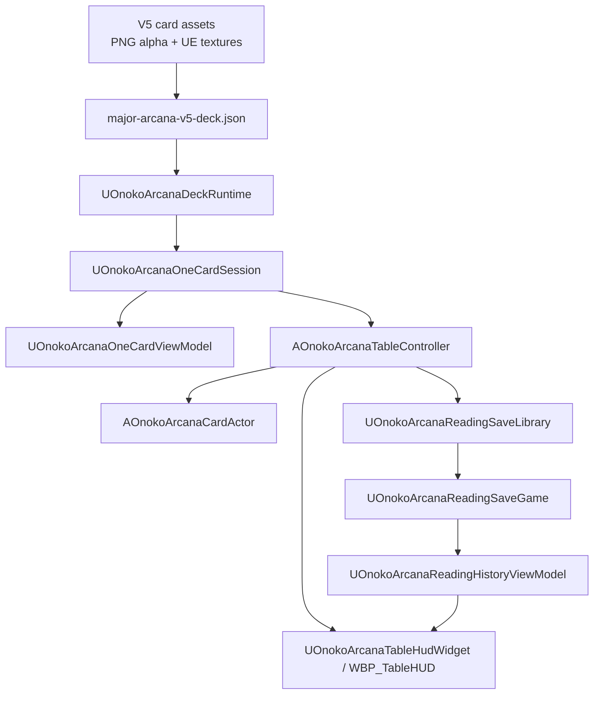

# ONOKO ARCANA 研究水準実装計画書

Updated: 2026-06-02  
引き継ぎ元: `019e78ce-7d75-7833-95d3-612892488a02`  
Project: `C:\ONOKO_PROJECT\ONOKO_ARCANA`  
Primary roadmap: `docs/roadmap/ONOKO_ARCANA_RESEARCH_GRADE_ROADMAP_V2_2026-05-31.md`

## 2026-06-02 媒体方針アップデート

現時点の最短MVPは、UE Editor/UMG配線をさらに深追いすることではなく、Web/Electron-readyな2D占い卓で「スプレッド選択、ドロー、順番めくり、解釈メモ、ガイド照合、履歴保存」の学習ループを先に完成させる方針へ切り替える。Unreal Engine は破棄せず、カード素材・3D演出・将来のプレミアム表現層として保持する。現行の本体候補は `web-app/index.html`、旧プロトタイプ証跡は `prototype/onoko-arcana-web-mvp-v1.html`。詳細は `docs/implementation/WEB_MVP_PIVOT_2026-06-02.md` と `.agent/requirements/20260602-0432-web-mvp-pivot/` を参照する。

## 要旨

ONOKO ARCANA は、タロットカードを物理的に所持していないユーザーでも、PC上の3D占い卓でカードを引き、意味を学び、自分の解釈を記録できる Unreal Engine 製デスクトップアプリケーションである。本計画の中心命題は、単に美麗なカード画像を表示することではない。ユーザーが「自分で読む」「補助解釈を見る」「履歴から学び直す」という反復学習を、占い卓という空間的インターフェース上で成立させることである。

前スレッドでは、初期の画像生成・透過処理・UE取り込み・ロードマップ策定・C++実装が段階的に進められた。その結果、V5方式の大アルカナ22枚および裏面1枚は、透過、外形、視覚QA、UE import、実行時manifest検証の各ゲートを通過している。さらに、C++側では V5 deck runtime、1枚引き session、card actor、table controller、HUD parent、SaveGame、reading history ViewModel まで実装され、commandlet による証跡も揃っている。

したがって、現在のボトルネックはカード再生成ではなく、UE Editor 上で実際に使える占い卓画面へ接続することである。今後の最短経路は、V5大アルカナを active candidate deck として固定し、`L_Phase1_OneCard_Table` に `AOnokoArcanaCardActor`、`AOnokoArcanaTableController`、`WBP_TableHUD` を手動または安定した自動化経路で接続し、1枚引き、表裏反転、正逆、解釈メモ、ガイド表示、保存、履歴確認までを同一画面で実証することである。

## 1. 背景と目的

### 1.1 企画背景

ユーザーの初期要求は「タロットカードによる占いを、タロットカードを所持していなくてもPCでできるようなソフト」「タロットカードでの占いを勉強しながら操作できるような感じ」であった。この要求は、一般的なカード表示ツール、単発の占いアプリ、画像鑑賞ソフトのいずれとも異なる。必要なのは、カードの意味を先に提示して答えを与える仕組みではなく、ユーザーがまず自分で感じた解釈を残し、その後に補助情報と照合できる学習構造である。

ONOKO ARCANA の体験価値は、次の三層から成る。

1. 占い卓体験: 3D空間にカードを置き、引き、めくることで、物理カードに近い儀式性を持たせる。
2. 学習体験: 正位置・逆位置・キーワード・study focus を、ユーザー自身の解釈の後に提示する。
3. 記録体験: 過去の問い、引いたカード、正逆、解釈メモ、ガイド表示状態を保存し、履歴から学び直す。

### 1.2 本計画の目的

本計画の目的は、ONOKO ARCANA を「カード素材が揃った実験」から「実際に学習ループを回せる縦断スライス」へ移行させるための実装順序、検証基準、リスク対策、完成判定を明文化することである。

ここでいう縦断スライスとは、以下が一続きで動く最小プロダクト単位である。

- V5大アルカナdeck manifestを読み込む。
- ユーザーが問いを入力する。
- 1枚のカードを重複なしで引く。
- まず裏面として表示し、操作により表面へ反転する。
- 正位置または逆位置を保持し、対応するキーワードを表示する。
- ユーザーが自分の解釈を入力する。
- 明示操作後に study focus / guide を表示する。
- 現在の読みを SaveGame に保存する。
- 保存済み履歴の件数、最新サマリ、選択中詳細をUIに出す。

### 1.3 計画の原則

本計画は、前スレッドで得られた失敗知見を前提とする。具体的には、カード画像の再生成を繰り返すだけではアプリ完成に近づかない。過去の問題は、画像品質、alpha、外形、UE表示、UI設計、保存構造が分離されていなかったことに由来する。以後は、各層を独立に検証し、証跡があるものだけを次工程へ渡す。

## 2. 現在の到達点

### 2.1 固定済みの基本方針

| 領域 | 現在の決定 |
|---|---|
| Engine | Unreal Engine 5.7 系のプロジェクト `Unreal/ONOKO_ARCANA/ONOKO_ARCANA.uproject` を使用する。 |
| 初期deck範囲 | 大アルカナ22枚と共通裏面1枚を先行対象とする。 |
| 小アルカナ | 大アルカナのruntime、UI、保存、履歴が安定するまで着手しない。 |
| カード画像 | V5 clean-start の `1024x1536` 縦長タロットシルエットを採用する。 |
| カード外形 | ユーザー確認により、V5の細め縦長外形をタロット感として採用済み。旧V4の広いbboxへ戻さない。 |
| 裏面サイズ | 裏面は Major 00 と可視bboxが一致するよう補正済み。 |
| alpha方針 | 生成時はクロマキー背景、ローカル処理で二値alpha化、UEでは masked material を用いる。 |
| テキスト方針 | カード名、キーワード、メモ、guide は画像内に焼き込まず、runtime UIで表示する。 |
| 体験方針 | ダッシュボードではなく、ONOKO風の cyber divination table を第一画面にする。 |

### 2.2 重要な方針修正

旧ロードマップでは、V4 layered card pipeline が主経路であった。しかし、実測により、V4は旧素材の混入、横長化、枠被り、人物品質劣化の問題を抱えることが判明した。以後は、V4を履歴として残しつつ、V5 clean-start を現行経路とする。

特に注意すべき点は、旧V4の固定bbox `(54,32,970,1514)` を現在の合格条件として扱わないことである。現在の合格条件は、V5 front/back の可視サイズ一致、alpha漏れなし、緑spillなし、UEで読み込めること、runtime panel と組み合わせて学習UIとして使えることである。

## 3. 引き継ぎ元スレッドの要約

### 3.1 初期構想

初期構想では、PC上でタロット占いを学びながら操作できるソフトが検討された。単なるカード画像ビューアではなく、占い卓、カード意味、ユーザー解釈、履歴保存を組み合わせた学習アプリが望ましいと判断された。

### 3.2 透過と画質の失敗分析

初期のカード画像生成では、背景透過が不安定で、カード外周の影や縁がalphaとして残った。また、クロマキー除去が人物の肌や手の色まで巻き込み、ONOKOキャラクターの顔・手・衣装に白い欠けが出た。これは、生成画像の品質だけでなく、alpha抜きアルゴリズムの設計ミスでもあった。

この分析により、次の原則が確立された。

- 背景に連結しているキー色だけを除去する。
- 人物内部の類似色を透明化しない。
- alpha外形は検証可能な基準で固定または補正する。
- マゼンタや緑の縁は透明化ではなく黒置換などの別処理で扱う。
- UE表示上の影とPNG alpha漏れを混同しない。

### 3.3 V4からV5への転換

Windows標準のフォトによる透過結果を一時的にV4の基準maskとして採用し、00/01/02/裏面の試作カードが作成された。しかし、UE上での目視確認により、イラストの横長化、枠被り、旧フレーム混入が顕在化した。これにより、旧カードを切り貼りする構造そのものが本番には向かないと判断された。

その後、V5 clean-start として、カード全体を新規生成しつつ、背景を厳格なクロマキーに分離する方式へ移行した。最初のV5魔術師サンプルは、旧フレーム混入、横長化、枠被りを大きく改善した。ユーザーはV5の細め縦長シルエットを「むしろタロットカード感があって良い」と承認した。

### 3.4 V5大アルカナ一式

V5方式により、大アルカナ22枚と裏面1枚が作成された。初期の `07 Chariot` は「戦車」よりも「力」寄りの二獣モチーフに読めたため再生成され、車輪付きチャリオットとして再採用された。裏面は当初、表面より可視alpha bboxが短かったが、Major 00 を基準に補正され、UE上でもサイズ一致が確認された。

最終的に、V5 visual QA は次の状態となった。

- Total assets: 23
- Adopted: 23
- Needs Regeneration: 0
- Blocked: 0

### 3.5 Unreal 実装の進捗

V5 asset gate の後、UE側で以下の実装が進んだ。

- V5 deck manifest の検証。
- 22枚の重複なしdrawを行う `UOnokoArcanaDeckRuntime`。
- 裏面、表面、逆位置回転を扱う `AOnokoArcanaCardActor`。
- 問い、draw、user interpretation、guide reveal、reset を保持する `UOnokoArcanaOneCardSession`。
- UMG向けにタイトル、正逆、キーワード、study focus、note を渡す `UOnokoArcanaOneCardViewModel`。
- カードActorとsession/viewmodelを接続する `AOnokoArcanaTableController`。
- `WBP_TableHUD` のC++親である `UOnokoArcanaTableHudWidget`。
- HUDを生成する `AOnokoArcanaPlayerController` と `AOnokoArcanaGameMode`。
- `FOnokoArcanaSavedReading`、`UOnokoArcanaReadingSaveGame`、`UOnokoArcanaReadingSaveLibrary`。
- 履歴件数、最新サマリ、選択中詳細を出す `UOnokoArcanaReadingHistoryViewModel`。

### 3.6 現在の未完了点

C++実装とcommandlet検証は進んでいるが、実際のUE Editor上の完成画面はまだ成立していない。`L_Phase1_OneCard_Table` は存在するが、Pythonによるmap actor spawn経路が `EXCEPTION_ACCESS_VIOLATION` を起こしており、自動生成結果を完成証跡として扱えない。次工程では、手動Editor配置、または別の安定自動化経路で `WBP_TableHUD` とカードActorを接続し、実画面での縦断スライスを証明する必要がある。

## 4. 証跡一覧

### 4.1 Asset / Visual QA

| 証跡 | 現在の意味 |
|---|---|
| `assets/generated/card-production-v5-full/reports/v5-alpha-audit.json` | V5 23素材のalpha監査。緑spillなし、外周alpha処理済み。 |
| `assets/generated/card-production-v5-full/reports/v5-alpha-contact-sheet-major-00-21-back.png` | V5全体の一覧目視確認。 |
| `assets/generated/card-production-v5-full/reports/v5-character-crop-report-major-00-21.png` | 顔、手、枠被りの目視補助。 |
| `assets/generated/card-production-v5-full/reports/v5-major-arcana-visual-qa.md` | 23素材すべて `Adopted`。 |
| `assets/generated/reports/v5-full-alpha-qa-map-unreal-editor-back-size-fixed-2026-06-01.png` | UE上で裏面サイズ補正後の目視確認。 |
| `data/major-arcana-v5-deck.json` | Phase 1 runtime のdeck source of truth。 |

### 4.2 Unreal / Runtime QA

| 証跡 | 現在の意味 |
|---|---|
| `Unreal/ONOKO_ARCANA/ImportStaging/MajorArcana_V5_Full/v5-full-import-result.json` | V5全23TextureのUE importが成功。 |
| `Unreal/ONOKO_ARCANA/Saved/V5FullAlphaQAMapResult.json` | V5 QA map生成が成功。 |
| `Unreal/ONOKO_ARCANA/Saved/V5DeckManifestValidationResult.json` | V5 manifest検証成功。22枚+裏面、全Texture `1024x1536`、badCount 0。 |
| `Unreal/ONOKO_ARCANA/Saved/Phase1DeckRuntimeTestResult.json` | deck runtime検証成功。22枚load、22枚重複なしdraw、山札切れ確認。 |
| `Unreal/ONOKO_ARCANA/Saved/Phase1RuntimeMaterialsResult.json` | 共有masked material生成成功。 |
| `Unreal/ONOKO_ARCANA/Saved/Phase1OneCardSessionTestResult.json` | sessionのload/start/draw/note/reveal/reset検証成功。 |
| `Unreal/ONOKO_ARCANA/Saved/Phase1OneCardViewModelTestResult.json` | HUD向けViewModelの表示状態遷移検証成功。 |
| `Unreal/ONOKO_ARCANA/Saved/Phase1HudReflectionSurfaceTestResult.json` | HUD widget、player controller、game mode のBlueprint露出検証成功。 |
| `Unreal/ONOKO_ARCANA/Saved/Phase2ReadingSaveGameTestResult.json` | 1枚引き結果をSaveGameへ保存・読込・削除できる。 |
| `Unreal/ONOKO_ARCANA/Saved/Phase2ReadingHistoryViewModelTestResult.json` | 2件の履歴読込、最新サマリ、選択詳細がViewModelから取得できる。 |

### 4.3 実装ハンドオフ

| 文書 | 役割 |
|---|---|
| `docs/implementation/PHASE1_ONE_CARD_TABLE_WIRING.md` | Phase 1 のカードActor、table controller、HUD接続契約。 |
| `docs/implementation/PHASE2_READING_SAVE_GAME.md` | SaveGameとreading history ViewModelの接続契約。 |
| `docs/design/card-production-v5-clean-start.md` | V5 clean-start の採用理由と制作ルール。 |
| `docs/design/overall-design-kanban.md` | UI TABLE、CARDS、STUDY、READING、ASSETS、POLISH の設計カンバン。 |

## 5. 研究課題と設計仮説

### 5.1 研究課題

本プロジェクトの研究課題は、生成AI由来のカード素材、Unreal Engine の3D表示、タロット学習UI、ローカル保存を、破綻なく1つの縦断体験へ統合できるかである。

具体的な問いは次の通りである。

1. V5大アルカナ素材は、UE上のruntime card actor として十分に安定して使えるか。
2. JSON manifest をsource of truth とする構造は、DataAsset化前の段階として十分に保守可能か。
3. ユーザーが先に解釈を書く学習フローを、UMG HUD と SaveGame だけで最小実装できるか。
4. 1枚引きのsession model を、後続の3枚引き、gallery、履歴画面へ拡張できるか。
5. UE Python map actor spawn のクラッシュを避けながら、Editor上の視覚証跡を安全に作れるか。

### 5.2 設計仮説

| 仮説 | 内容 | 検証方法 |
|---|---|---|
| H1 | V5大アルカナ23素材は、これ以上カード再生成せず Phase 1 に進める品質である。 | visual QA 23 Adopted、UE import、manifest validation、実画面確認。 |
| H2 | `data/major-arcana-v5-deck.json` は、Phase 1中のsource of truthとして十分である。 | commandletで全Texture解決、runtime load、drawを検証。 |
| H3 | カードの意味や学習文は画像内ではなくUI表示にすべきである。 | ViewModelで正逆keyword、study focus、note表示を検証。 |
| H4 | SaveGame + history ViewModel で最初の学習履歴は成立する。 | 保存、読込、件数、最新サマリ、選択詳細のcommandlet検証。 |
| H5 | 現時点のmap自動生成は完成証跡に使わず、手動Editor接続を優先する方が安全である。 | UE Python actor spawn crash の再発を避け、Editor配置後のスクリーンショットを証跡化。 |

## 6. システム構成

### 6.1 レイヤ構造

### 6.2 各レイヤの責務

| レイヤ | 責務 | 代表ファイル |
|---|---|---|
| Asset | カード表面、裏面、alpha、UE Textureを保持する。 | `assets/generated/card-production-v5-full/`, `ImportStaging/MajorArcana_V5_Full` |
| Data | card id、名前、正逆keyword、study focus、texture path、QA statusを保持する。 | `data/major-arcana-v5-deck.json` |
| Runtime | manifest load、shuffle/draw、正逆、山札状態を扱う。 | `OnokoArcanaDeckRuntime.*` |
| Session | 1回の読みの問い、draw結果、メモ、guide reveal stateを扱う。 | `OnokoArcanaOneCardSession.*` |
| Presentation | カードActor、正逆回転、front/back materialを扱う。 | `OnokoArcanaCardActor.*` |
| ViewModel | UMGが読める文字列や表示状態を整形する。 | `OnokoArcanaOneCardViewModel.*`, `OnokoArcanaReadingHistoryViewModel.*` |
| Control | HUD操作をsession、card actor、saveに接続する。 | `OnokoArcanaTableController.*` |
| UI | 実際のbutton、textbox、textblockを持つ。 | `UOnokoArcanaTableHudWidget`, `WBP_TableHUD` |
| Persistence | 読みの保存、読込、削除、履歴取得を扱う。 | `OnokoArcanaReadingSaveGame.*`, `OnokoArcanaReadingSaveLibrary.*` |

## 7. 要件

### 7.1 機能要件

| ID | 要件 | 受け入れ基準 |
|---|---|---|
| F-01 | V5 deck manifest を読み込める。 | 22枚と裏面のTextureがUEでresolveし、非Adoptedがあれば停止する。 |
| F-02 | 1枚引きができる。 | 1session内で重複なくカードをdrawし、山札切れを検出する。 |
| F-03 | 裏面から表面へrevealできる。 | draw直後は裏面、reveal後は選択カード表面が表示される。 |
| F-04 | 正位置・逆位置を保持できる。 | reversedの場合、カードActorが180度回転し、reversedKeywordsがUIへ出る。 |
| F-05 | ユーザー解釈を先に入力できる。 | guide未表示の状態でもnote textboxが使える。 |
| F-06 | guide / study focus を明示操作後に表示できる。 | `RevealGuide()` 成功後にstudy focusが出る。 |
| F-07 | 現在の読みを保存できる。 | question、card、orientation、keywords、study focus、user note、guide revealed、timestampがSaveGameに保存される。 |
| F-08 | 保存履歴を確認できる。 | 件数、最新サマリ、選択中タイトル、詳細、空状態がUIへ出る。 |
| F-09 | resetできる。 | current draw、note、guide state、card actor表示が初期状態へ戻る。 |

### 7.2 非機能要件

| ID | 要件 | 基準 |
|---|---|---|
| NF-01 | 操作応答性 | draw、reveal、panel更新は短いanimation後に即時反映される。 |
| NF-02 | 読みやすさ | 暗い卓上でもUI textのcontrastを確保し、画像内文字に依存しない。 |
| NF-03 | 再現性 | 重要な合格判定はJSON、スクリーンショット、文書に残す。 |
| NF-04 | 失敗時可視化 | missing texture、save失敗、empty history、invalid deck data を見える状態にする。 |
| NF-05 | 拡張性 | 1枚引きsession modelを3枚引き、gallery、historyへ流用できる。 |
| NF-06 | 依存抑制 | Phase 1中は新しい外部依存を増やさず、既存UE C++/Blueprint/UMG/Pythonで進める。 |

### 7.3 ユーザー体験要件

- 第一画面は説明ページではなく、実際の占い卓である。
- ユーザーはカードを引く前に問いを入力できる。
- ユーザーはguideを見せられる前に、自分の解釈を書く余白を持つ。
- 正逆、keywords、study focus は学習補助であり、ユーザーの解釈を上書きしない。
- 履歴は単なるログではなく、過去の問いと自分の解釈を読み返すための学習資産である。

## 8. フェーズ計画

### 8.1 Phase 0A: Evidence Freeze

Status: Done

目的は、失敗原因と合格条件を分離し、以後のカード制作が感覚的な再生成ループに戻らないようにすることであった。

完了条件:

- 透過漏れ、影、人物破壊、外形不一致を別問題として分類する。
- UE側のmasked material要件を明確化する。
- 生成段階、alpha処理、UE表示の責務を分離する。

### 8.2 Phase 0B: Card Pipeline

Status: Superseded by V5

V4 layered route は試作として有効な知見を残したが、実画面の品質問題により本線から外す。現在はV5 clean-start routeが有効である。

V5完了条件:

- 22枚+裏面のraw/alphaが存在する。
- alpha auditが通る。
- contact sheet と character crop QA が存在する。
- visual QAで全23素材が `Adopted`。

現在状態:

- 完了済み。

### 8.3 Phase 0C: Unreal Alpha QA

Status: Done for V5 candidate

目的は、PNG上で正しく見えるカードがUE上でもTextureとして読み込めるか、alpha漏れや裏面サイズ不一致がないかを確認することである。

完了条件:

- V5全23TextureがUE importされる。
- QA mapでcheckerboard / dark surface上のalphaが確認できる。
- 裏面と表面の見え幅が一致する。
- QA mapはあくまで技術検証であり、最終卓デザインと混同しない。

現在状態:

- 完了済み。

### 8.4 Phase 0D: Production Preview Table

Status: Automation blocked / Manual assembly required

目的は、白いQA面ではなく、ONOKOらしい占い卓として第一印象を成立させることである。dark wood、black acrylic、electric blue observation rings、muted gold trim、central card slot、side panel を基調とする。

現在の問題:

- PythonによるUE map actor spawnが複数経路で `EXCEPTION_ACCESS_VIOLATION` を起こしている。
- したがって、自動生成された `L_Phase1_OneCard_Table` を完成証跡として扱えない。

次の完了条件:

- Editor上で `AOnokoArcanaCardActor` と `AOnokoArcanaTableController` が配置される。
- Phase1用materialとV5裏面Textureがcard actorに割り当てられる。
- HUDとcontrollerが接続され、draw/reveal/reset/save/history が実画面で操作できる。
- checkerboardではないproduction-like table screenshotを保存する。

### 8.5 Phase 1: One-Card Vertical Slice

Status: In progress / C++ foundation verified

目的は、1枚引きの占い体験を、素材、runtime、UI、保存のすべてを通して成立させることである。

完了済み:

- `UOnokoArcanaDeckRuntime`
- `AOnokoArcanaCardActor`
- `UOnokoArcanaOneCardSession`
- `UOnokoArcanaOneCardViewModel`
- `AOnokoArcanaTableController`
- `UOnokoArcanaTableHudWidget`
- `AOnokoArcanaPlayerController`
- `AOnokoArcanaGameMode`
- shared masked runtime material
- commandlet verification

未完了:

- `WBP_TableHUD` の実Blueprint作成。
- 実map上のcard actor/controller/HUD接続。
- 実画面でのdraw、reveal、note、guide、save、history確認。

Phase 1完了条件:

- ユーザーが問いを入力し、1枚引きできる。
- 裏面表示から表面revealができる。
- 正逆に応じたキーワードが表示される。
- user interpretation をguide前に入力できる。
- guide reveal後に study focus が表示される。
- resetで初期状態に戻る。
- 実画面スクリーンショットとcommandlet結果が両方残る。

### 8.6 Phase 2: Save / Learning Loop

Status: Started / C++ foundation verified

目的は、1回の占いを一過性の体験で終わらせず、学習履歴として保存・再閲覧できるようにすることである。

完了済み:

- `FOnokoArcanaSavedReading`
- `UOnokoArcanaReadingSaveGame`
- `UOnokoArcanaReadingSaveLibrary`
- `UOnokoArcanaReadingHistoryViewModel`
- `AOnokoArcanaTableController::SaveCurrentReading()`
- `RefreshReadingHistory()`
- `SelectHistoryReading(Index)`

未完了:

- `WBP_TableHUD` 上の保存ボタンと履歴表示。
- full history list / scrollable list。
- SaveGame schema migration policy。

Phase 2完了条件:

- 実画面から保存できる。
- restart後も保存済みreadingを読み直せる。
- no-history stateが表示される。
- 最新履歴と選択詳細が表示される。
- full list化前でも学習履歴として最低限使える。

### 8.7 Phase 3: Three-Card Spread and Study Gallery

Status: Pending

目的は、1枚引きで検証したsession schemaを3枚引きとstudy galleryへ拡張することである。

開始条件:

- Phase 1とPhase 2の実画面確認が完了している。
- one-card saved reading schemaが破綻していない。
- UI上でhistoryが最低限読める。

完了条件:

- Past / Present / Future などの3slot spreadを持つ。
- 1spread内でカード重複がない。
- 各slotが正逆とkeywordを持つ。
- 22枚galleryからカード詳細を見られる。
- gallery detail と saved reading が意味的に接続できる。

### 8.8 Phase 4: Major Arcana Production Pass

Status: Functionally advanced via V5

V5により大アルカナのproduction passは機能的に前倒しで進んでいる。ただし、runtime table上で初めて見える問題が出た場合のみ再開する。

再開条件:

- 実画面で特定カードの顔、手、象徴、frame、text panelが学習用途に耐えない。
- back/front scale mismatch が再発する。
- UE lighting下で特定カードが判読不能になる。

非再開条件:

- 単にもっと良い絵にしたい。
- polish前に印象を変えたい。
- 小アルカナ着手前の不安をカード再生成で解消したい。

### 8.9 Phase 5: Polish

Status: Pending

対象:

- card flip animation
- hover glow
- ambient table effect
- observation ring animation
- sound cue
- subtle camera motion

開始条件:

- one-card draw/save/historyが実画面で動く。
- UI text readability が確保されている。
- polishが基本操作を阻害しない。

### 8.10 Phase 6: Windows Build

Status: Pending

開始条件:

- Phase 1、Phase 2、最低限のPhase 3が完了している。
- packaged buildでSaveGame pathが正常に動く。
- missing assetがない。

完了条件:

- Windows development build が作成できる。
- 初回起動、1枚引き、保存、restart後読込が通る。
- packaged環境でTexture参照が壊れない。

### 8.11 Phase 7: Minor Arcana Expansion

Status: Blocked

小アルカナは、Major Arcana runtimeが安定するまで開始しない。78枚化は、asset数、QA負荷、Texture memory、UI検索性、保存データ量を一気に増やすため、早期着手はリスクが高い。

開始条件:

- Major Arcana 22枚のruntime体験が完成している。
- 3枚引きが安定している。
- asset generation / audit / UE import / visual QA の手順が再利用可能である。

## 9. 直近作業指示

### 9.1 最優先ゴール

次の作業ブロックのゴールは、`WBP_TableHUD` を作り、実map上で1枚引き学習ループを操作可能にすることである。C++の追加より、Editor/Blueprint配線と実画面証跡を優先する。

### 9.2 作業手順

1. `/Game/ONOKOArcana/Maps/L_Phase1_OneCard_Table` を開く。
2. 中央reading slotに `AOnokoArcanaCardActor` を配置する。
3. card actor に `/Game/ONOKOArcana/Phase1/Materials/M_Phase1_CardMasked_TextureParam` を割り当てる。
4. back texture に `/Game/ONOKOArcana/Cards/Textures/V5Full/T_Card_Back_ONOKO_V5_Alpha` を割り当てる。
5. `AOnokoArcanaTableController` を配置する。
6. controller の `ReadingCardActor` に配置済みcard actorを割り当てる。
7. `DefaultQuestion` に `今の自分に必要な視点は？` などの短い仮質問を入れる。
8. `UOnokoArcanaTableHudWidget` を親にして `WBP_TableHUD` を作る。
9. 推奨widget名に従い、Draw、Reveal、Note、Guide、Save、History、Reset を配置する。
10. `AOnokoArcanaPlayerController` がHUDを生成し、table controllerへ接続することを確認する。
11. 実画面で draw -> reveal -> note -> guide -> save -> refresh history -> reset を通す。
12. checkerboardではないproduction-like table screenshotを `assets/generated/reports/` に保存する。

### 9.3 `WBP_TableHUD` 最小widget契約

| Widget Name | Type | 用途 |
|---|---|---|
| `QuestionTextBox` | `EditableTextBox` | 問いの入力 |
| `StartReadingButton` | `Button` | reading開始 |
| `DrawButton` | `Button` | 1枚引き |
| `RevealCardButton` | `Button` | カード表面表示 |
| `UserInterpretationTextBox` | `MultiLineEditableTextBox` | ユーザー解釈 |
| `RevealGuideButton` | `Button` | guide / study focus 表示 |
| `SaveReadingButton` | `Button` | 現在の読みを保存 |
| `RefreshHistoryButton` | `Button` | 履歴再読込 |
| `ResetButton` | `Button` | 現在の読みをリセット |
| `CardTitleText` | `TextBlock` | カード名 |
| `OrientationText` | `TextBlock` | 正位置・逆位置 |
| `KeywordsText` | `TextBlock` | active keywords |
| `StudyFocusText` | `TextBlock` | guide後の学習文 |
| `ErrorText` | `TextBlock` | エラー |
| `StateText` | `TextBlock` | 状態 |
| `HistoryCountText` | `TextBlock` | 保存件数 |
| `HistoryLatestSummaryText` | `TextBlock` | 最新履歴サマリ |
| `HistorySelectedTitleText` | `TextBlock` | 選択履歴タイトル |
| `HistorySelectedDetailText` | `TextBlock` | 選択履歴詳細 |
| `HistoryEmptyStateText` | `TextBlock` | 履歴なし状態 |

### 9.4 直近作業の完了条件

- `WBP_TableHUD` が `UOnokoArcanaTableHudWidget` を親にしている。
- button類がC++側のoptional binding名と一致する。
- draw後、card actorがV5裏面または表面を正しく表示する。
- reveal後、選択カード名、正逆、keywordsがUIへ出る。
- guide前はstudy focusが隠れる。
- guide後はstudy focusが出る。
- save後、history count または latest summary が更新される。
- reset後、note、guide state、current card stateが初期化される。
- 実画面スクリーンショットが残る。

## 10. 検証計画

### 10.1 変更リスク別の検証

| 変更種別 | 最低検証 | 強い検証 |
|---|---|---|
| Blueprint widget配線 | Editor上の手動操作 | `Phase1HudReflectionSurface` の再実行 |
| C++ controller変更 | UE build | 関連commandlet全再実行 |
| SaveGame変更 | SaveGame test | restart smoke test |
| Deck manifest変更 | manifest validation | deck runtime 22 draw test |
| Card asset変更 | alpha audit | visual QA + UE import + QA map |
| Map/lighting変更 | screenshot | 複数視点、表裏、正逆の目視 |

### 10.2 推奨検証順

1. UE C++ build: `ONOKO_ARCANAEditor Win64 Development`
2. `V5DeckManifestValidationResult.json`
3. `Phase1DeckRuntimeTestResult.json`
4. `Phase1OneCardSessionTestResult.json`
5. `Phase1OneCardViewModelTestResult.json`
6. `Phase1HudReflectionSurfaceTestResult.json`
7. `Phase2ReadingSaveGameTestResult.json`
8. `Phase2ReadingHistoryViewModelTestResult.json`
9. Editor manual smoke test
10. Screenshot proof

### 10.3 手動スモークテスト

1. アプリまたはEditor PIEを起動する。
2. `QuestionTextBox` に問いを入力する。
3. `StartReadingButton` を押す。
4. `DrawButton` を押す。
5. card actorが裏面を表示していることを確認する。
6. `RevealCardButton` を押す。
7. 表面Texture、正逆、keywordsが一致することを確認する。
8. `UserInterpretationTextBox` に短い解釈を書く。
9. `RevealGuideButton` を押す。
10. study focus が表示されることを確認する。
11. `SaveReadingButton` を押す。
12. `RefreshHistoryButton` を押す。
13. 履歴件数、最新サマリ、選択詳細が表示されることを確認する。
14. `ResetButton` を押し、初期状態に戻ることを確認する。

## 11. リスク管理

| リスク | 影響 | 現在の判断 | 対策 |
|---|---|---|---|
| UE Python actor spawn crash | map自動生成が止まる | 既に複数回再現 | 直近は手動Editor配置を優先。原因調査は別タスク化。 |
| V4 bboxへの回帰 | V5で承認済みの縦長感が崩れる | 高リスク | 現行計画に「V5外形を採用」と明記。 |
| カード再生成ループ | runtime実装が進まない | 高リスク | 実画面でhard blockerが出るまで再生成しない。 |
| UMG widget名不一致 | C++ bindingが効かない | 中リスク | 推奨widget名を計画と実装docに固定。 |
| SaveGame schema変更 | 既存履歴が読めなくなる | 中リスク | schema version とmigration方針をPhase 2後半で追加。 |
| Texture memory増大 | 小アルカナ拡張時に重くなる | 将来リスク | 78枚化はMajor runtime完成後。 |
| スクリーンショット誤取得 | 証跡が信用できない | 過去に発生済み | 前面window確認、無効画像の破棄、ファイル名に用途を明記。 |
| QA mapとproduction mapの混同 | 見た目完成の誤判定 | 中リスク | QA mapはalpha/size証跡、production tableは別証跡とする。 |

## 12. 非目標

次の作業ブロックでは、以下を行わない。

- 小アルカナ56枚の生成。
- 全カードの再生成。
- Windows build packaging。
- 完成polish animationの作り込み。
- 3枚引きの先行実装。
- full history list の凝ったUI。
- DataAsset化。
- UE Python map spawn crash の深追い。

これらは重要だが、現在の縦断スライス完成には直結しない。

## 13. 完成判定

### 13.1 MVP完成

MVPは、1枚引き学習ループが実画面で成立した時点で完成とする。

必要条件:

- V5大アルカナがactive deckとして読み込まれる。
- 1枚引き、reveal、正逆、keywords、study focusが動く。
- user interpretation を入力できる。
- readingを保存できる。
- 保存履歴の最低限表示ができる。
- 実画面スクリーンショットとJSON証跡が残る。

### 13.2 Alpha完成

Alphaは、1枚引きに加えて3枚引きとstudy galleryの最小版が動いた時点で完成とする。

必要条件:

- 3枚引きでカード重複がない。
- 3slotそれぞれが正逆とkeywordsを持つ。
- galleryで22枚を閲覧できる。
- saved reading と gallery detail が意味的に接続される。

### 13.3 Beta完成

Betaは、Windows packaged buildで主要操作が通る時点で完成とする。

必要条件:

- packaged buildが作成できる。
- 初回起動、1枚引き、3枚引き、保存、restart後読込が通る。
- missing texture / missing widget がない。
- UI textが読める。
- 既知のクラッシュがない。

### 13.4 v1.0完成

v1.0は、大アルカナ学習アプリとして他者に渡せる品質に到達した時点で完成とする。

必要条件:

- Major Arcana 22枚の体験が安定している。
- 1枚引き、3枚引き、履歴、study gallery が使える。
- 操作説明なしでも基本操作が理解できる。
- 保存データの破損や読込失敗にUI上の対処がある。
- 最低限のpolish animationと音が入り、読みやすさを損なわない。
- READMEまたは起動手順が整備されている。

## 14. 小アルカナ拡張条件

小アルカナは、v1.0前またはv1.0後の拡張として扱う。早期に着手しない理由は、単純に枚数が増えるだけでなく、QA、カード意味、検索性、保存履歴、UI密度が同時に増大するためである。

開始条件:

- Major Arcana runtime が安定している。
- 生成・透過・visual QA・UE import の手順が再現可能である。
- 78枚化後のTexture memoryとロード時間の見積りがある。
- UIが78枚galleryに耐える。

## 15. 意思決定ログ

| 日付 | 決定 | 理由 |
|---|---|---|
| 2026-05-31 | 画像生成段階から透過処理を再計画する。 | 初期alpha処理が人物内部を破壊したため。 |
| 2026-05-31 | V4 layered route を試作する。 | 透過と外形を分離するため。 |
| 2026-06-01 | V4を本線から外し、V5 clean-startへ移行する。 | V4は横長化、枠被り、旧素材混入が残ったため。 |
| 2026-06-01 | V5の細め縦長シルエットを採用する。 | ユーザーがタロットカード感として承認したため。 |
| 2026-06-01 | `07 Chariot` を再生成する。 | 旧版が戦車より力のモチーフに読めたため。 |
| 2026-06-01 | 裏面bboxをMajor 00に合わせる。 | UE上で裏面サイズが短く見えたため。 |
| 2026-06-01 | カード再生成よりruntime縦断実装を優先する。 | V5 visual QAが23 Adoptedとなり、カードlaneがボトルネックでなくなったため。 |
| 2026-06-01 | map自動生成を完成証跡にしない。 | UE Python actor spawn crash が再発したため。 |

## 16. トレーサビリティ

| 目的 | 要件 | 実装 | 証跡 |
|---|---|---|---|
| V5 deckを使う | F-01 | `UOnokoArcanaDeckRuntime` | `V5DeckManifestValidationResult.json` |
| 1枚引きする | F-02 | `DrawOne`, `UOnokoArcanaOneCardSession` | `Phase1DeckRuntimeTestResult.json`, `Phase1OneCardSessionTestResult.json` |
| 表裏を切り替える | F-03 | `AOnokoArcanaCardActor` | `PHASE1_ONE_CARD_TABLE_WIRING.md` |
| 正逆を扱う | F-04 | draw result, actor rotation, ViewModel | `Phase1OneCardViewModelTestResult.json` |
| 自分の解釈を書く | F-05 | `SubmitUserInterpretation`, HUD textbox | `PHASE1_ONE_CARD_TABLE_WIRING.md` |
| guideを後出しする | F-06 | `RevealGuide`, study focus visibility | `Phase1OneCardViewModelTestResult.json` |
| 読みを保存する | F-07 | `UOnokoArcanaReadingSaveLibrary` | `Phase2ReadingSaveGameTestResult.json` |
| 履歴を見る | F-08 | `UOnokoArcanaReadingHistoryViewModel` | `Phase2ReadingHistoryViewModelTestResult.json` |
| 学習卓にする | UX要件 | `WBP_TableHUD`, production map | 次のEditor screenshotで検証 |

## 17. 最終結論

ONOKO ARCANA の現在地点は、素材制作フェーズの出口と、実アプリ体験フェーズの入口にある。V5大アルカナと裏面は、現時点でruntimeへ渡してよい。C++基盤も、1枚引き、ViewModel、HUD parent、SaveGame、history ViewModel まで検証済みである。

次にやるべきことは明確である。カードを増やさず、抽象的な設計を増やさず、`WBP_TableHUD` と `L_Phase1_OneCard_Table` を接続し、ユーザーが1枚引き学習ループを実際に触れる状態へ進める。ここを通過すれば、ONOKO ARCANA は「カード素材とコードの集合」から「占いを学ぶための最小アプリ」へ移行する。

直近の作業は、`docs/implementation/PHASE1_ONE_CARD_TABLE_WIRING.md` と `docs/implementation/PHASE2_READING_SAVE_GAME.md` を手順書として、Editor上のHUD/Actor/Controller接続を完了させることである。
